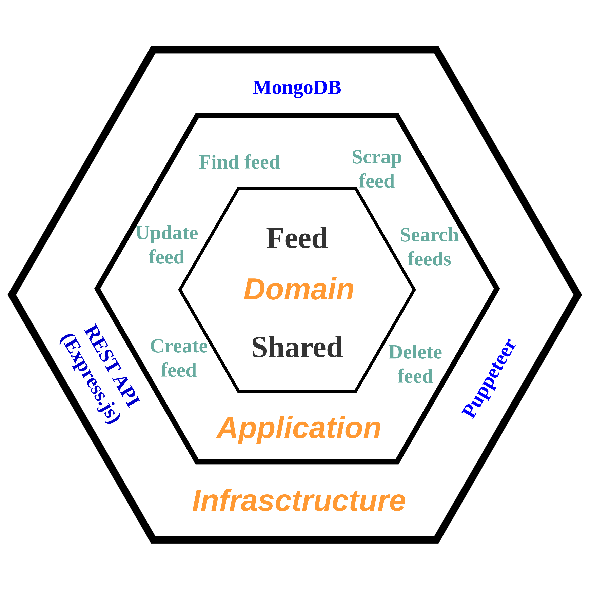

## Description

"daily-trends" repository is a web application (backend) created with the aim of centralizing news from the most representative newspapers in the country. It follows a solid architecture based on Domain-Driven Design (DDD) principles with the goal of being scalable efficiently and quickly.

[](https://daily-trends-app-ivan-v2.onrender.com) _BACKEND --> Wait 10 seconds until RENDER service is up_

[](https://daily-trends.netlify.app/) _FRONT --> Check it now and you will see lastest news (Now, is needed to wait a little because the scraping process is fired on the fly if any of the news is older than the current day. In a future, it will be fired with an Scheduler but it costs more money in the Cloud Provider)_


<table>
  <tr>
    <td valign="center">
      <h4>Tools</h4>
      <ul list-style-type="none">
        <li>
           Node.js (Typescript)
        </li>
        <br/>
        <li>
           Express
        </li>
        <br/>
        <li>
           MongoDB
        </li>
        <br/>
        <li>
           Docker
        </li>
        <br/>
        <li>
           Jest
        </li>
        <br/>
      </ul>
    </td>
  </tr>
</table>

## Hexagonal architecture diagram



## Requirements

```
Node.js --> min v18.16.0 (nvm use)
docker-compose --> to create DDBB instance (test and dev)
```

## Installation

```bash
$ npm install
```

## Running the app

```bash
# Makefile option
$ make start

# Or
$ npm run up:docker:local # to up Docker with Mongo (docker-compose necessary)
$ npm run dev
```


## Test

```bash
# Makefile option
$ make test # Run all tests

# Or
$ npm run up:docker:local # follow we can use whatever of the below commands

    # all tests
    $ npm run test

    # unit tests
    $ npm run test:unit

    # features e2e (cucumber)
    $ npm run test:features

    # integration (infrastructure)
    $ npm run test:integration
```

## TODO Improves

<ol>
  <li>Implement CQRS (commandBus and queryBus). Commands and Queries will be a handler and middleware between external app (Express.js API) and bounded context. It also allow communication between use cases</li>
  <li>Implement pagination with cursors in MongoDB infrastructure</li>
  <li>Hide <b>GET feed/scrap</b> endpoint and create CRON task for use it</li>
  ...
</ol>
